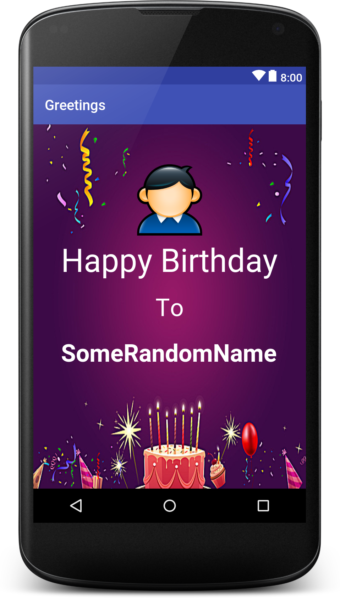

## Greetings App


### Layout Code
```xml
<?xml version="1.0" encoding="utf-8"?>
<RelativeLayout xmlns:android="http://schemas.android.com/apk/res/android"
    xmlns:app="http://schemas.android.com/apk/res-auto"
    xmlns:tools="http://schemas.android.com/tools"
    android:layout_width="match_parent"
    android:layout_height="match_parent"
    android:background="@drawable/background"
    tools:context="tech.geeksquad.greetings.MainActivity">

    <TextView
        android:id="@+id/textView2"
        android:layout_width="wrap_content"
        android:layout_height="wrap_content"
        android:layout_alignParentTop="true"
        android:layout_centerHorizontal="true"
        android:layout_marginTop="159dp"
        android:text="Happy Birthday"
        android:textAppearance="@style/TextAppearance.AppCompat.Display2"
        android:textColor="@android:color/background_light" />

    <TextView
        android:id="@+id/textView3"
        android:layout_width="wrap_content"
        android:layout_height="wrap_content"
        android:layout_centerHorizontal="true"
        android:layout_centerVertical="true"
        android:text="To"
        android:textAppearance="@style/TextAppearance.AppCompat.Display1"
        android:textColor="@android:color/background_light" />

    <TextView
        android:id="@+id/textView4"
        android:layout_width="wrap_content"
        android:layout_height="wrap_content"
        android:layout_alignStart="@+id/textView2"
        android:layout_below="@+id/textView3"
        android:layout_marginTop="18dp"
        android:text="SomeRandomName"
        android:textAllCaps="false"
        android:textAppearance="@style/TextAppearance.AppCompat.Display1"
        android:textColor="@android:color/background_light"
        android:textStyle="bold" />

    <ImageView
        android:id="@+id/imageView2"
        android:layout_width="100dp"
        android:layout_height="100dp"
        android:layout_alignParentTop="true"
        android:layout_centerHorizontal="true"
        android:layout_marginTop="56dp"
        android:adjustViewBounds="false"
        android:cropToPadding="false"
        android:scaleType="fitCenter"
        app:srcCompat="@drawable/man" />

</RelativeLayout>
```

### Layout


